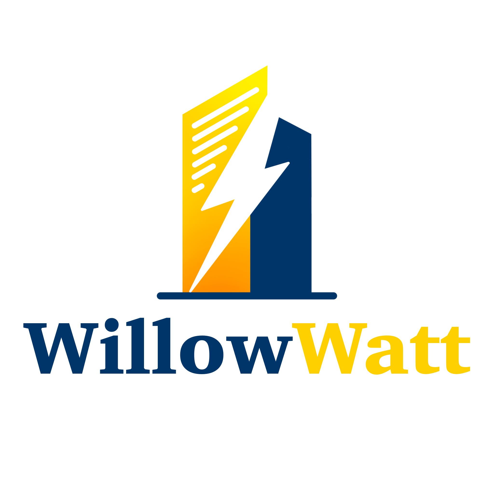

# 

**WillowWatt** is partnering with **Willow** to transform energy management in buildings through advanced **AI**, **Machine Learning (ML)**, and **Optimization** techniques. With buildings in the US consuming 76% of all electricity and contributing to 40% of total CO₂ emissions, improving energy efficiency is a critical challenge.

### Project Overview

Our **capstone project** focuses on **co-optimizing buildings and assets** to maximize energy and operational efficiencies, while minimizing costs and environmental impact. By leveraging **Willow's cutting-edge digital twin technology** and **real-time data**, we are developing a solution that dynamically optimizes energy usage across hundreds of facilities and assets.

### Key Features

- **Energy Forecasting**: We have designed and trained a machine learning model using **Random Forest Regression** to forecast weekly energy consumption. This model, built in **Python** using **Scikit-learn**, is packaged with **ONNX** for deployment within Willow’s platform.
  
- **Energy Optimization**: The system visualizes energy consumption forecasts, identifies peak energy usage periods, and simulates strategies to reduce loads, such as adjusting **HVAC** or **lighting schedules**.

- **Real-Time Decision-Making**: By forecasting energy demand in advance, decision-makers can proactively implement strategies to reduce inefficiencies, rather than reacting after the fact.

### Impact

This approach aims to:
- Reduce **energy costs**
- Lower **greenhouse gas emissions**
- Enhance **energy resilience**

Ultimately, it contributes to achieving **NAU’s carbon neutrality target for 2030**.

### Technologies Used

- **Python**: For developing the machine learning model
- **Scikit-learn**: For implementing **Random Forest Regression**
- **ONNX**: For packaging and deploying the model
- **Willow’s Digital Twin Technology**: For real-time energy data collection and analysis
